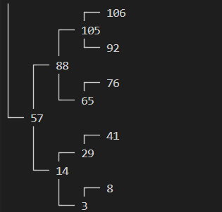

# Binary_Search_Tree

#### Implemented Balanced Binary Search Tree in Vanilla Javascript

## Architecture

The project consists of two classes :

1. **Node** : Holding the data, leftChild and rightChild
2. **Tree** : Creates a balanced bst from an array

## Features/ Methods :

-   `prettyPrint(root)` to visualize the tree in the console.
-   `includes(value)` return true if given value exists in the tree otherwise returns false
-   `insert(value)` inserts new value in the bst, if the value already exists, does nothing
-   `deleteItem(value)` accepts a value and removes it from the tree. If the given value doesn’t exist in the tree, it
    does nothing
-   `levelOrderForEach(callback)` that accepts a callback function as its parameter and then traverses the tree in
    breadth-first level order and calls the callback on each value as it traverses, passing each value (not the nodes)
    as an argument.
-   `inOrderForEach(callback)` that accepts a callback function as its parameter and then traverses the tree in in-order
    depth-first level order and calls the callback on each value as it traverses, passing each value (not the nodes) as
    an argument.
-   `preOrderForEach(callback)` that accepts a callback function as its parameter and then traverses the tree in
    pre-order depth-first level order and calls the callback on each value as it traverses, passing each value (not the
    nodes) as an argument.
-   `postOrderForEach(callback)` that accepts a callback function as its parameter and then traverses the tree in
    post-order depth-first level order and calls the callback on each value as it traverses, passing each value (not the
    nodes) as an argument.
-   `height(value)` returns the height of the node containing the given value.
-   `depth(value)` returns the depth of the node containing the given value.
-   `isBalanced()` to check if the tree is balanced or not
-   `rebalance()` to rebalance the tree, if unbalanced by insertions

## How to test :

1. Import the Tree class

2. Create an instance to the class and pass an array to it. `const test = new Tree(array)`

3. Run `test.prettyPrint(test.root)` to get a visual of the tree in the console

    

4. Use above mentioned methods to modify the Tree.

-   Use [demo.js](./demo.js) to test the Project, it already has tree initialized and tested.
